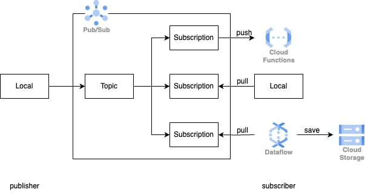

# Pub/Sub sample

## Description
This project demonstrates how to use Google Cloud Pub/Sub to send and receive messages between two services. In this project, I tried two subscription types: pull and push. The overall architecture is shown below:
<p align="center">
  
</p>

## Prerequisites
- Service Account: A service account with the following permissions:
  - Pub/Sub
  - Cloud Functions
  - Cloud Storage
  - Dataflow
- Local Environment:
  - Google Cloud SDK (gcloud CLI) installed and authenticated.
  - Poetry installed. (This repository was tested with Python 3.11.6)

## Setup
Install dependencies:
  ```bash
  poetry install
  ```

## Deploy Cloud Functions
For subscription type `push`, we will deploy a Cloud Function that will be triggered by Pub/Sub messages.
```bash
cd cloudfunctions
bash deploy.sh <TOPIC_NAME>
```

## Run subscribers with type `pull`
```bash
cd pubsub
poetry run python sub_pull.py --project-id=<PROJECT_ID> --subscription-id=<SUBSCRIPTION_ID>
```

For the integration with Dataflow, run the following command:
```bash
cd pubsub
poetry run python storage.py \
  --project=<PROJECT_ID> \
  --region=<REGION> \
  --topic-id=projects/<PROJECT_ID>/topics/<TOPIC_ID> \
  --output-path=gs://<BUCKET_NAME>/samples/output \
  --runner=DataflowRunner \
  --window-size=2 \
  --num-shards=2 \
  --temp_location=gs://<BUCKET_NAME>/temp
```
You can stop the program when Dataflow is running by pressing `Ctrl+C`.

## Run publisher
```bash
cd pubsub
poetry run python pub.py --project-id=<PROJECT_ID> --topic-id=<TOPIC_ID>
```

When you run the publisher, you should see the 3 subscribers receiving and processing the messages.
